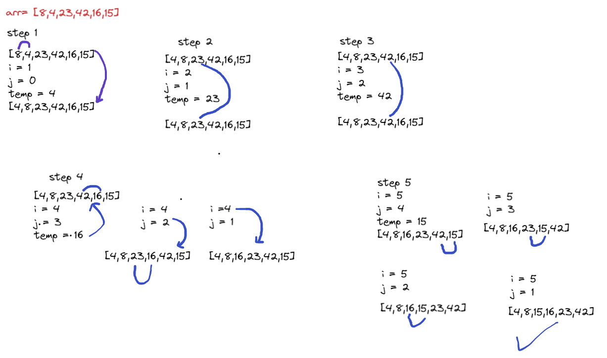

# Insertion sort

Insertion sort is a simple sorting algorithm that works similar to the way you sort playing cards in your hands. The array is virtually split into a sorted and an unsorted part. Values from the unsorted part are picked and placed at the correct position in the sorted part.


# Pseudocode

```
  InsertionSort(int[] arr)

    FOR i = 1 to arr.length

      int j <-- i - 1
      int temp <-- arr[i]

      WHILE j >= 0 AND temp < arr[j]
        arr[j + 1] <-- arr[j]
        j <-- j - 1

      arr[j + 1] <-- temp

```

# step by step




we have an array = [8,4,23,42,16,15]

### step 1

we will use the insertion sort to sort array and here in the first step we will compare between first and second elements so will compare between [8,4] i = 1 , j = 0 ,  temp = array[i] = 4 so will check if the  second element `4` less than first element `8` then will the second element will be in place of the first element. 

the arrat will be [4,8,23,42,16,15]


### step 2

in the second step i = 2 , j = 1 , temp = array[i] = 23 here we will check between second `8` elent and third element `23` so the third element less than second element false so the array will be same the elements will no change.

the array will be same [4,8,23,42,16,15]

### step 3

in the third step i = 3 , j = 2 , temp = array[i] = 42 , here we will check between the the third element `23` and the fourth element `42` so the fourth element less than the third element ? false so the array will be same the elements will no change.

the array will be same [4,8,23,42,16,15]


### step 4 

in the forth step i = 4, j = 3, temp = array[i] = 16 , here we will check between the fourth element `24` and the fifth element `16` so the fifth element less than fourth element ? true so switch between elements.

the array will be [4,8,16,23,42,15]

### step 5 

in the fifth step i = 5 , j = 4 , temp = array[i] = 15 , here will compare between `42` and` 15` so the `15` less than `42 ` so switch between them the array will be [4,8,16,23,15,42]

i = 5 , j = 3 , temp = array[i] = 15 here will compare between `23` and` 15` so the `15` less than `23 ` so switch between them the array will be [4,8,16,15,23,42]

i = 5 , j = 2 , temp = array[i] = 15 here will compare between `16` and` 15` so the `15` less than `16 ` so switch between them the array will be [4,8,15,16,23,42]


---------------------------

# Efficency 

- time complexity >> O(n^2) because we are using nested loop and the time will be increased

- space complexity >> O(1) because we are using same array and will being sorted

