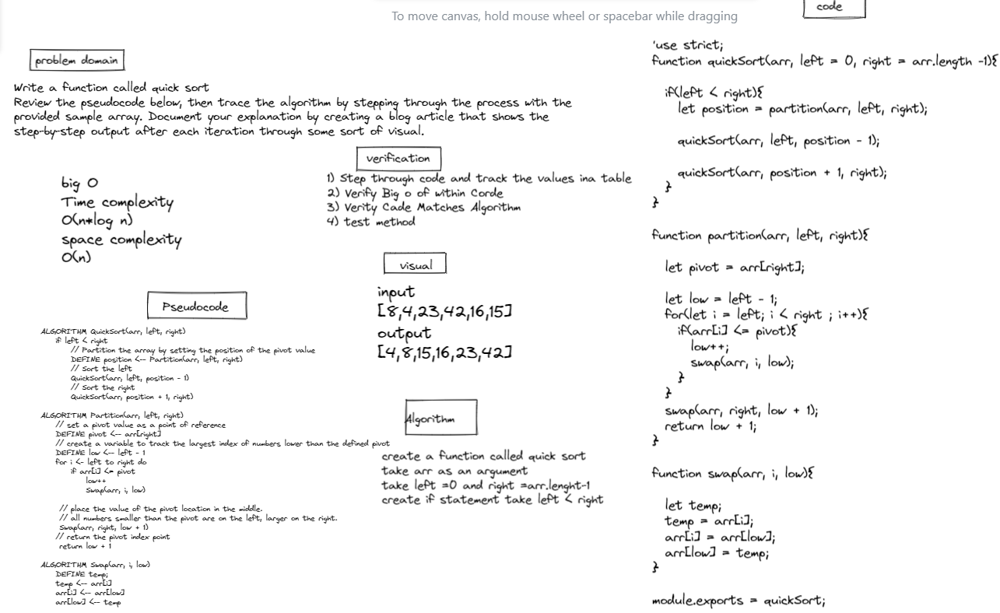
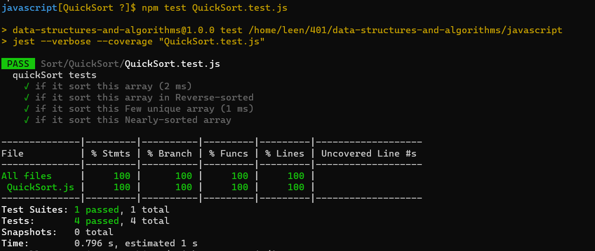

# Code Challenge 28

# Quick Sort

**Assignment**

Review the pseudocode below, then trace the algorithm by stepping through the process with the provided sample array. Document your explanation by creating a blog article that shows the step-by-step output after each iteration through some sort of visual.

# whiteboard  

# tests

