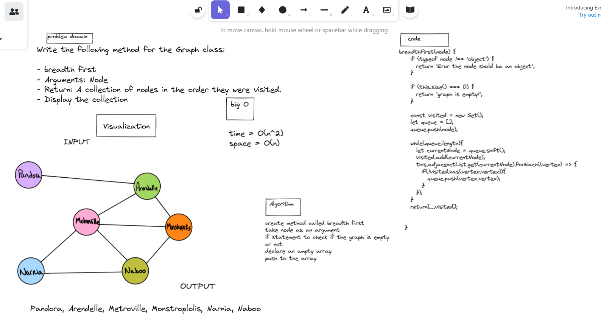

# graph-breadth-first

# Feature Tasks

Write the following method for the Graph class:

- breadth first
- Arguments: Node
- Return: A collection of nodes in the order they were visited.
- Display the collection

# Approach & Efficiency

Time Complexity: o(n^2)
Space : o(n)
# uml 

