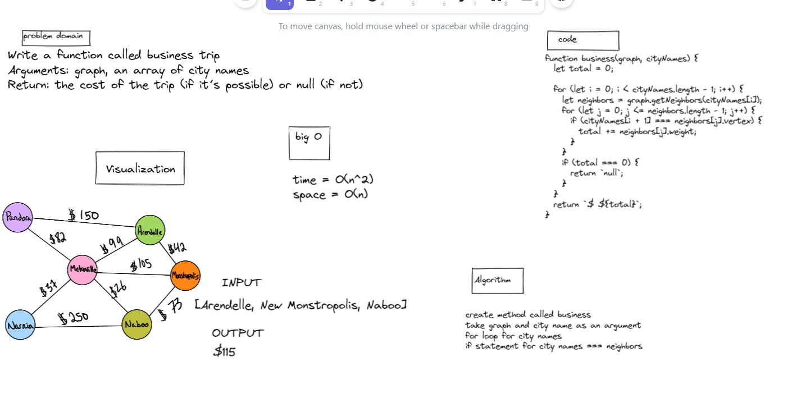
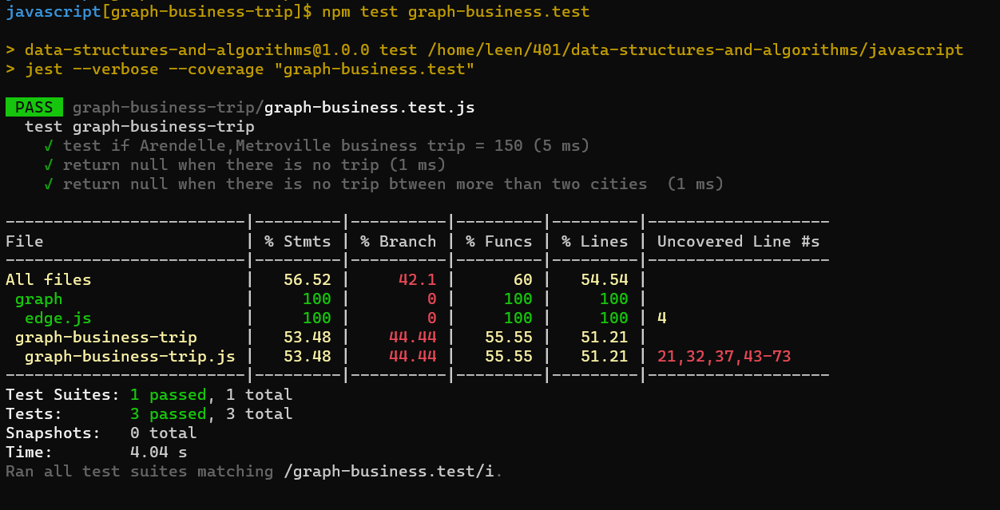
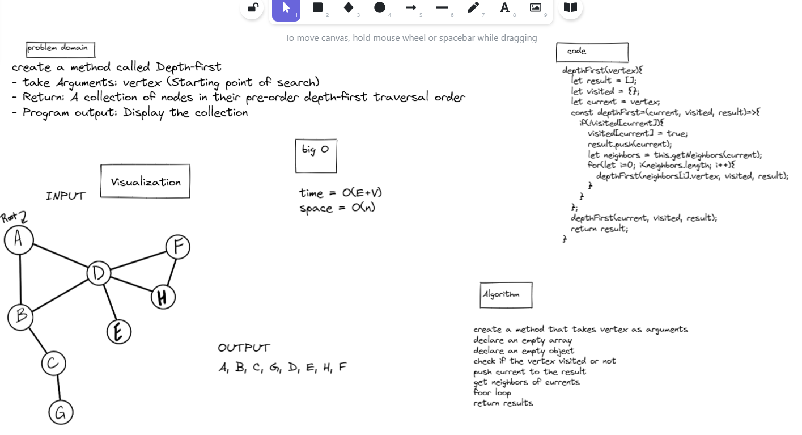
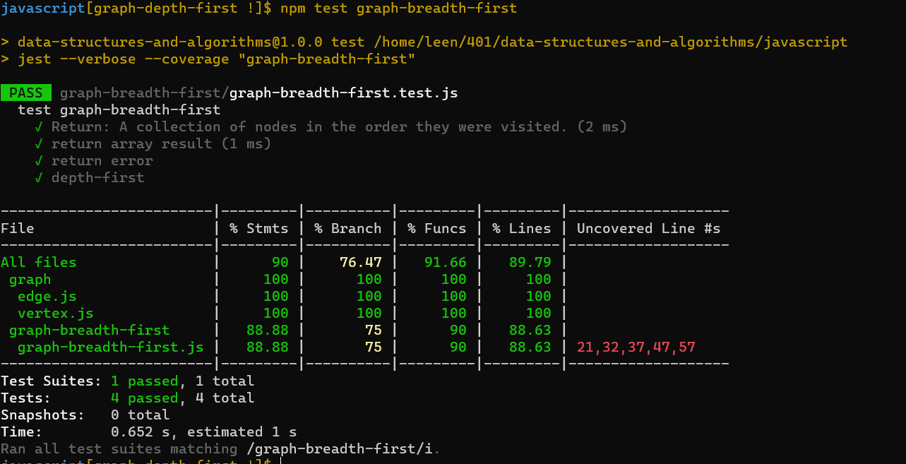

# graph-business-trip

## Feature Tasks

- Write a function called business trip
- Arguments: graph, array of city names
- Return: the cost of the trip (if it’s possible) or null (if not)

# Approach & Efficiency

Time Complexity: o(n^2)
Space : o(n)

# Whiteboard

# test 

--------------

# Depth First Traversal

The algorithm can be implemented with a recursive function that keeps track of previously visited nodes. If a node has not been visited, we call the function recursively.

## Challenge

Write the following method for the Graph class:

- Name: Depth first
- Arguments: Node (Starting point of search)
- Return: A collection of nodes in their pre-order depth-first traversal order
- Program output: Display the collection

## Approach & Efficiency

time complexity = O(E+V) where E is number of edges and V number of vertex 

## Solution

