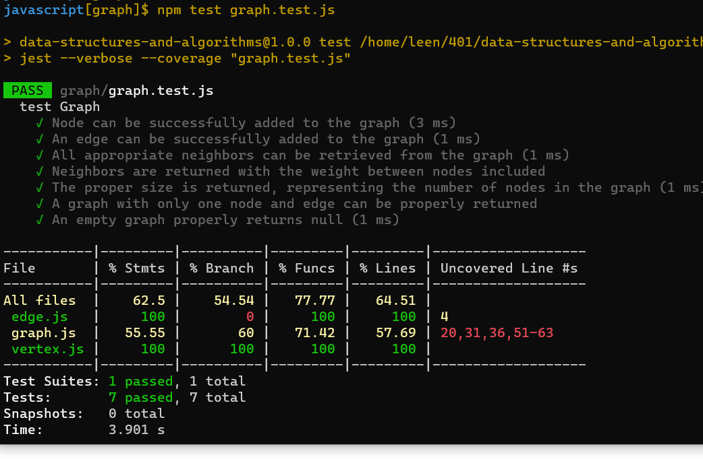

# Graph 

A graph is a data structure where a node can have zero or more adjacent elements. The connection between two nodes is called edge. Nodes can also be called vertices.  The degree is the number of edges connected to a vertex. 

# Features
Implement your own Graph. The graph should be represented as an adjacency list, and should include the following methods:

- add node
    - Arguments: value
    - Returns: The added node
    - Add a node to the graph
- add edge
    - Arguments: 2 nodes to be connected by the edge, weight (optional)
    - Returns: nothing
    - Adds a new edge between two nodes in the graph
    - If specified, assign a weight to the edge
    - Both nodes should already be in the Graph
- get nodes
    - Arguments: none
    - Returns all of the nodes in the graph as a collection (set, list, or similar)
- get neighbors
    - Arguments: node
    - Returns a collection of edges connected to the given node
         - Include the weight of the connection in the returned collection
- size
    - Arguments: none
    - Returns the total number of nodes in the graph

# Approach & Efficiency 

### Time complexity
o(n)

### Time space 

O(n)

# test 

