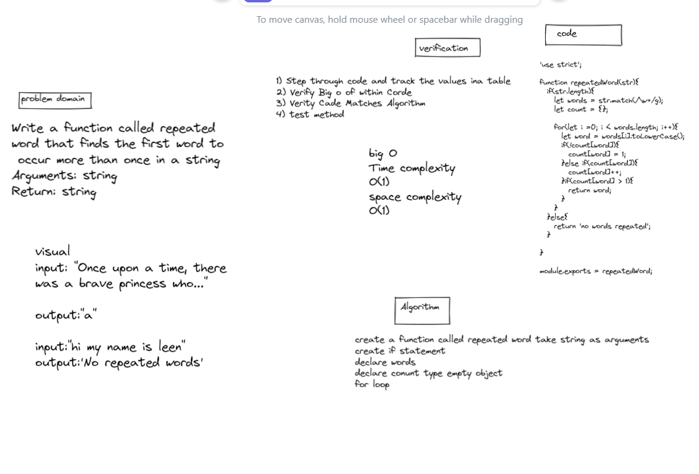
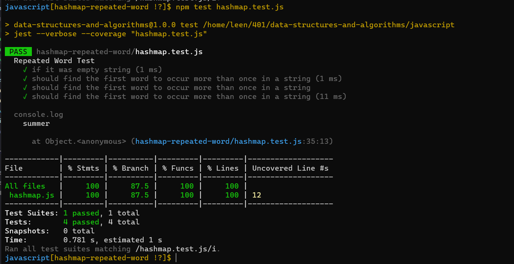

# code challenge 31

# hashmap repeated word

**Assignment**

***Feature Tasks***

Write a function called repeated word that finds the first word to occur more than once in a string
Arguments: string
Return: string

# Approach & Efficiency

    - time O(n)

    - space O(1)

# whiteboard  

# tests

