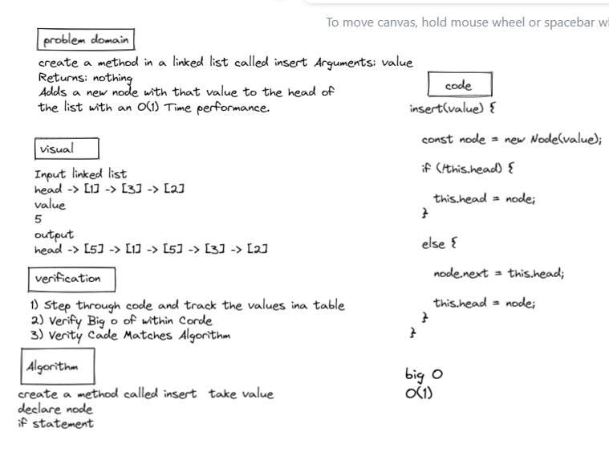
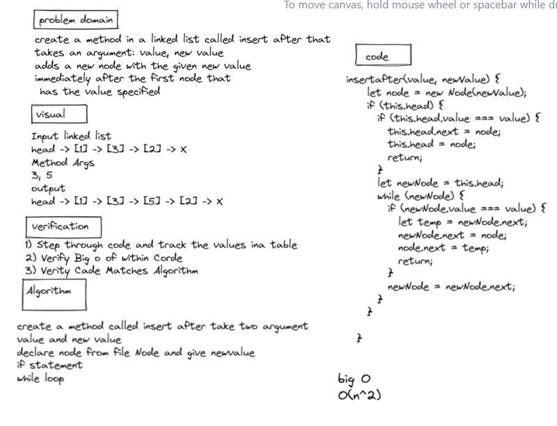
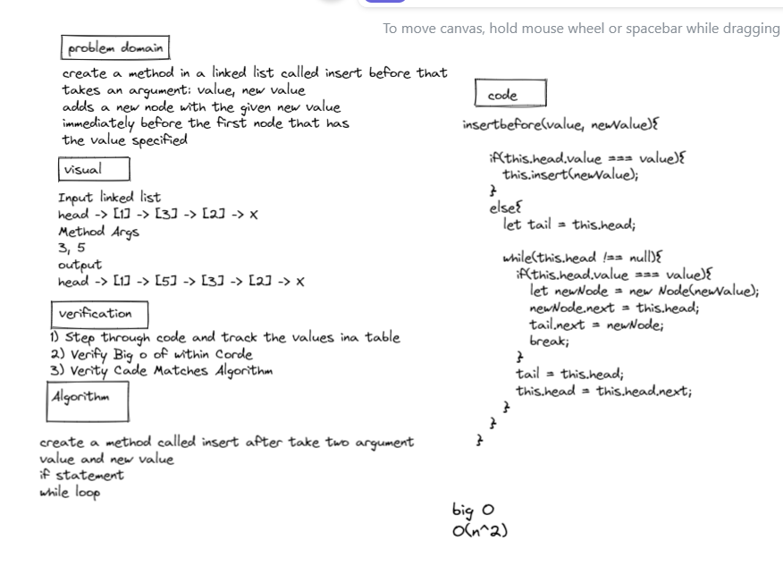
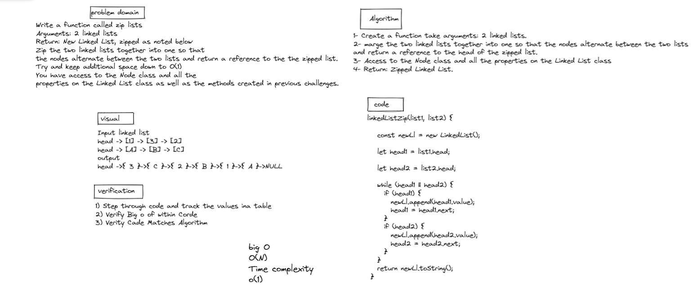

# linked list 

## code challenge 5

create 3 method for linked list 

- insert 
- include 
- toString


```
the insert method to Adds a new node with that value to the head of the list with an O(1) Time performance

the include method to Indicates whether that value exists as a Node’s value somewhere within the list.

the toString method to Returns: a string representing all the values in the Linked List, formatted as:
"{ a } -> { b } -> { c } -> NULL"

```

## insert 



------------------------
## code challenge 6
## *problem domain*

create 3 method for linked list : 

- append 
- insert before 
- inert after 


the append method to adds a new node with the given value to the end of the list. 

the insert before method to adds a new node with the given new value immediately before the first node that has the value specified.

the insert after to adds a new node with the given new value immediately after the first node that has the value specified.


## *Time Complexity:*

- Access O(n)
- Insertion O(1)

## *space Complexity:*

- O(n)

## insert after 



## insert before 



--------------------------------------------

# code challenge 7 linked-list-kth

create method called kth 

``` 
the kth method to Return the node’s value that is k places from the tail of the linked list.

```


--------------------------------------------

# code challenge 8 linked-list-zip

create method called linkedListZip 


