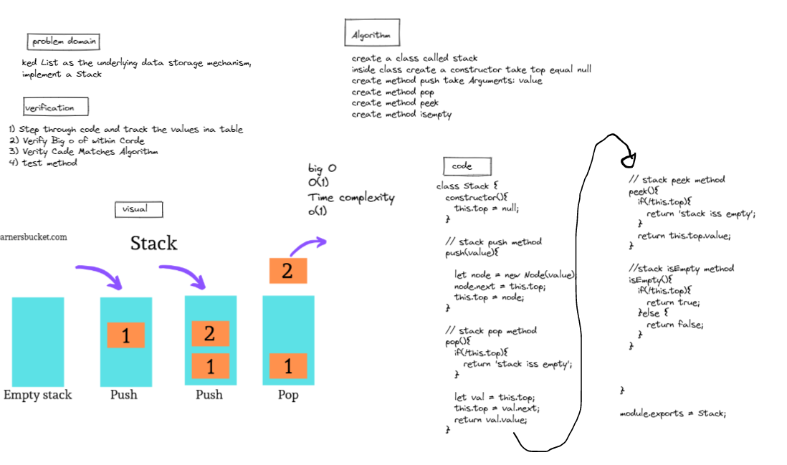
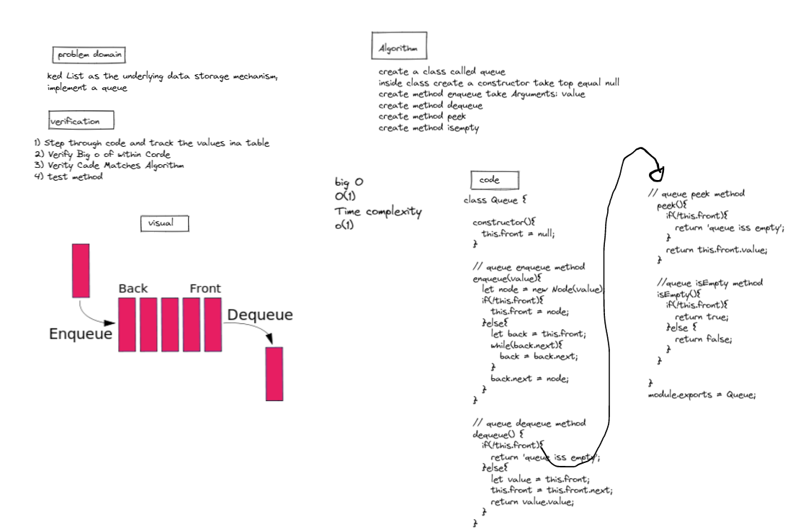

# stacks and queue

## Challenge

***Using a Linked List as the underlying data storage mechanism, implement both a Stack and a Queue***

## Approach & Efficiency

### stack 

- push  >> time complexity(1)

- pop  >> time complexity(1)

- peek >> time complexity(1)

- isEmpty  >> time complexity(1)

-------------

## queue 

- enqueue >> time complexity(1)

- dequeue >> time complexity(1)

- peek >> time complexity(1)

- isEmpty  >> time complexity(1)

----------------

## whiteboard

### stack 

-----------

### queue 

