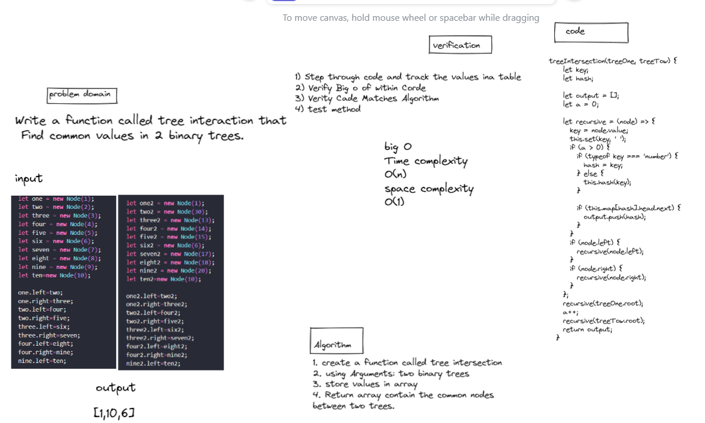
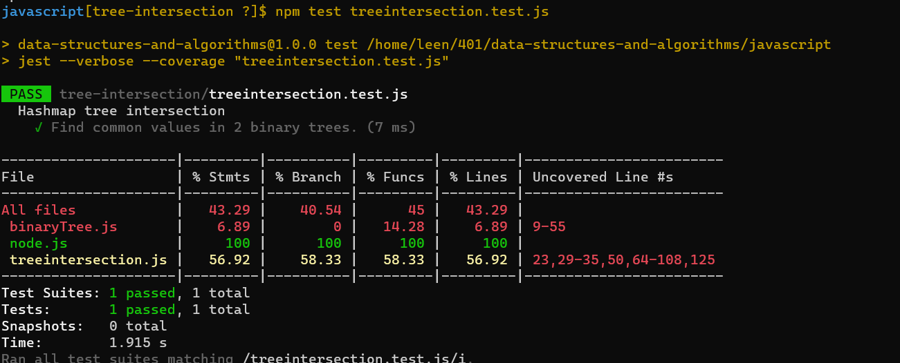

#  tree intersection

## Feature Tasks

Write a function called tree_intersection that takes two binary trees as parameters.
Using your Hashmap implementation as a part of your algorithm, return a set of values found in both trees.

------------------------------

- set
    - Arguments: key, value
    - Returns: nothing
    - This method should hash the key, and set the key and value pair in the table, handling collisions as needed.
    - Should a given key already exist, replace its value from the value argument given to this method.
- get
    - Arguments: key
    - Returns: Value associated with that key in the table
- contain
    - Arguments: key
    - Returns: Boolean, indicating if the key exists in the table already.
- keys
    - Returns: Collection of keys
- hash
    - Arguments: key
    - Returns: Index in the collection for that key

# Approach & Efficiency

- set: 
    - space O(1)
    - time O(1)
- get: 
    - space O(1)
    - time O(1) - time O(n) if there is a collision
- contains:   
    - space O(1)
    - time O(1)
- hash:
    - space O(1)
    - time O(1)
- tree intersection:
    - space O(n)
    - time O(1)

# API

- set (key , value) as arguments : This method should hash the key, and set the key and value pair in the table, handling collisions as needed.
- get (key) as arguments : should Returns: Value associated with that key in the table
- contains (key) as arguments : should Returns: Boolean, indicating if the key exists in the table already
- hash key) as arguments : should Returns: Index in the collection for that key

# whiteboard  

# tests

